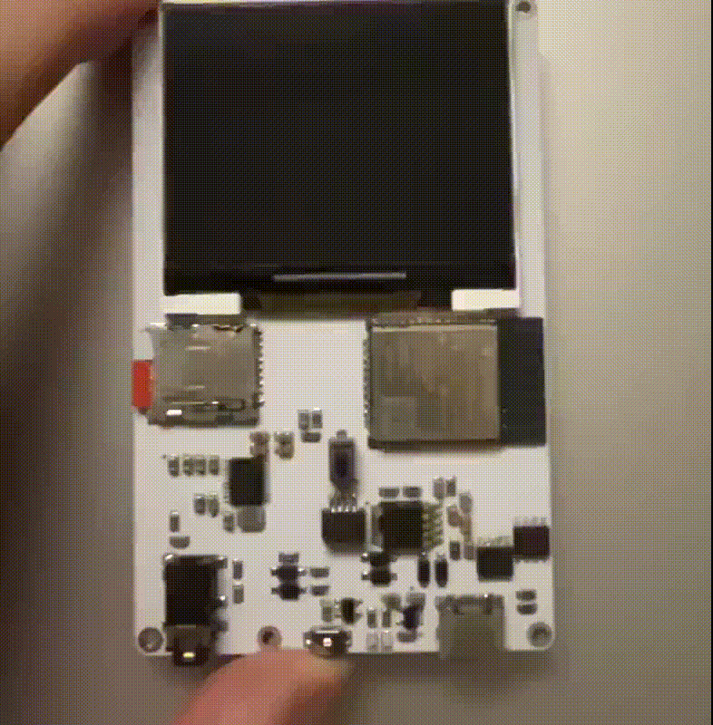

# ESP_MOVIE
Movie (Motion JPEG and MP3) playback library for ESP32 series.
 
## Features
- Simultaneous playback of Motion JPEG video and MP3 audio from SD card files.
- Motion JPEG-only playback.
- MP3-only playback.
- JPEG image display.
- Text rendering.
- Rectangle fill operation for a specified display area.
- Display backlight brightness control.

## Platform
- Arduino IDE (arduino-esp32)
- ESP-IDF

## Hardware Support
### MCU
- Currently tested on ESP32-S3 development board only. Support for other ESP32 series devices has not been verified yet.
 
### Display
- Supports Intel 8080 (8-bit parallel) interface with DMA transfer. SPI interface is not supported.
- Supports RGB565 color format.
- Currently tested with the ILI9342 display controller only.
 
### Audio
- Supports I2S audio output.
- Currently tested with the PCM5102 DAC only. Compatibility with other I2S DACs has not been verified yet.
 
### SD Card
- Includes a built-in SPI-mode SD card driver.

## Included Sample Files
The examples include sample Motion JPEG (AVI), MP3, JPEG files for quick testing.

## Included Libraries
ESP_MOVIE uses the following third-party libraries.
- [esp-libhelix-mp3](https://github.com/chmorgan/esp-libhelix-mp3.git) (chmorgan): Apache License 2.0
- [esp_new_jpeg](https://github.com/espressif/esp-adf-libs/tree/master/esp_new_jpeg) (espressif): Espressif MIT License
- [font8x16](https://github.com/hubenchang0515/font8x16.git) (hubenchang0515): MIT License

##

